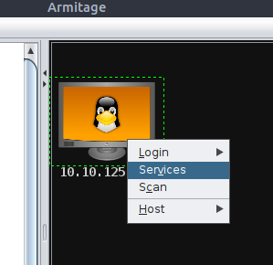

<h1>Het hacken van een onveilige postgres service</h1>
Met deze demostructie wordt gedemonstreerd hoe een onveilige configuratie van de apparaten in je netwerk kunnen leiden tot een volledig gecompromitteerd netwerk. Hiermee kan een potentiele dreigingsactor binnen een paar stappen volledige toegang krijgen tot alle apparaten en data in je netwerk. Hackers/cybercriminelen scannen het hele internet af, dus iedereen zou hier de dupe van kunnen worden.

<h2>Het voorbereiden van Armitage</h2>
Het runnen van package.sh, switchen naar non-root user, msfdb initialiseren (gebruik username msf en wachtwoord msf), switchen naar root user, armitage starten.

```bash
bash ~/Desktop/Additional\ Tools/armitage/package.sh && su ubuntu && msfdb init && sudo su && ~/Desktop/Additional\ Tools/Armitage/release/unix/armitage 
```

<h2>Scannen van de target</h2>
1. Klik op Hosts > Nmap Scan > Intense Scan om een volledige nmap scan op de target uit te voeren.


2. Vul het IP in van de target. Dit kan een enkel IP-adres zijn of een range aan IP-adressen.


3. Zodra de target is gescand verschijnt het in het venster rechtsboven. Rechtermuisklik op de target en klik op 'Services'. 




4. In het onderste venster worden nu per host de open poorten met bijbehorende services weergegeven. 


5. Ga in het venster linksboven op zoek naar 'postgres' om op alleen postgres aanvalstechnieken te filteren.


<h2>Bruteforcen van de target</h2>
1. Sleep de 'postgres_login' module naar de target en klik op 'Launch' in het pop-up venster.


<p>Zie in het onderste venster dat er geldige credentials zijn gevonden, namelijk postgres:password</p>


<h2>Hashdump op de target</h2>
1. Sleep de 'postgres_hashdump' module naar de target, vul in het pop-up venster de juiste credentials in, en klik op 'Launch'.


2. Zie in het onderste venster dat er inderdaad gebruikersnamen met bijbehorende wachtwoord-hashes gevonden zijn. Deze hashes kunnen gebruikt worden in Pass-the-Hash aanvallen, of kunnen gekraakt worden om ze om te zetten naar plaintext wachtwoorden.


<h2>Uitlezen van bestanden op de target</h2>
1. Sleep de 'postgres_readfile' module naar de target, vul in het pop-up venster de juist credentials in, en klik op 'Launch'.


2. Zie in het onderste venster dat je inderdaad de inhoud van de bestanden uit kunt lezen. 


<h2>Volledige toegang tot de target verkrijgen</h2>
1. Sleep de 'postgres_copy_from_program_cmd_exec' module naar de target, vul in het pop-up venster de juiste credentials in, selecteer 'Use a reverse connection', en klik op 'Launch'.


2. Zie in het onderste venster dat er een nieuwe command shell sessie is geopend. 


3. Rechtermuisklik op de target > Shell 1 > Interact.


4. Zie in het onderste scherm dat je nu volledige command line toegang hebt tot de target.


